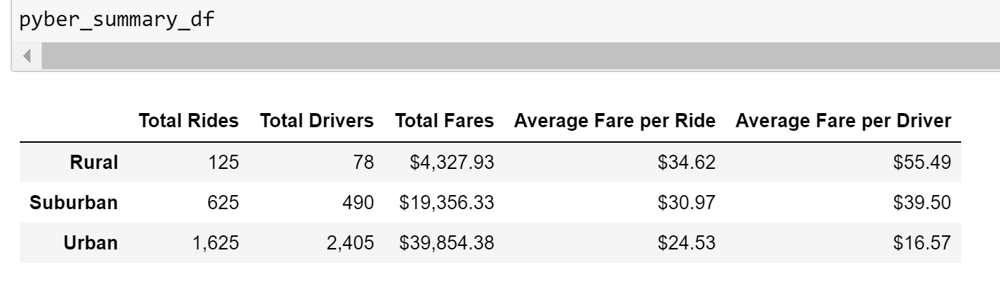
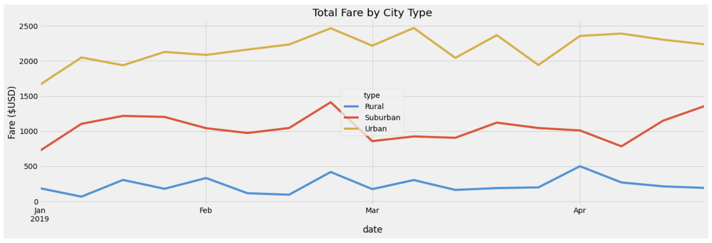

# PyBer_Analysis
Matplotlib

---

## Link to Complete Code

---

## Overview of the Analysis: 
The initial analysis for PyBer included analyzing very large amounts of data to show the relationship between the type of city and the number of drivers and riders, and the relationship between the percentage of total fares and riders and drivers by type of city. The purpose of this analysis was for PyBer to make informed decisions that will improve access to the ride sharing app as well as improve affordability.  

The purpose of the new analysis was to aggregate the ride sharing data by city type and to compare the results of the different city types in order to make recommendations to the decision makers at the ride sharing app company PyBer.

---

## Results: 

Below are the images of the results of this analysis:

### Summary DataFrame

### PyBer Fare Summary Chart

### The Differences in Ride-Sharing Data Among the Different City Types:

- Total Rides - The number of rides is much smaller in rural cities compared with suburban and urban cities. Suburban cities have 5 times more rides than rural cities, and urban cities have 13 times more rides compared to rural cities. 

- Total Drivers - In rural cities, the number of drivers is significantly smaller than in suburban and urban cities. The difference is quite stark with 6 times more drivers in suburban cities and about 30 times more drivers in urban cities when comparing to the rural cities. 

- Total Fares - The amount of money by city type is also quite different. Rural cities total is significantly lower than the totals for suburban and urban cities. Suburban is almost 5 times more, and urban is about 9 times more total fares. 

- Average Fare per Ride - The average fare per ride is highest in the rural cities at $34.62, in suburban cities it is $30.97 and in urban cities it is the cheapest at $24.53 per ride. 

- Averge Fare per Driver - In rural cities the fare per driver is the highest at $55.49. In suburban cities it is $39.50 and in urban cities the average fare per driver is the lowest at $16.57 which is roughly a third of the fare compared with rural cities. 

- Total Fare by City Type - In the multiply line chart, over a 4 month period, there is a consistent picture of total fares by city type, where in the urban cities the total fares is consistently higher, the suburban in the middle and the rural has the lowest total fares. There is a small amount of fluctuation over the four month period in all city types but no time is the fluctuation significant enough to change the order between the city types. This means that the rural cities are consistenly brining in the lowest amount of total fares and so on. 

## Summary: 
Three business recommendations to the CEO for addressing disparities among the city types:
1. To improve access to rides in rural cities, increasing the number of drivers in the rural cities might help. It looks like the number of drivers in rural cities is significantly smaller than in the other types of cities. It may be that this is making it harder for people to use this service, if they need a ride and a driver is not available to take them. Providing incentives for drivers to work in rural cities may be necessary to close this gap. 
2. To improve affordability, it would be a good idea to reduce the fare per ride in rural cities. If the fare is high, it may leave some customers out possibly reducing revenues. In urban cities, even though the average fare per ride is lowest, the total fares is highest, it might not work out exactly the same in rural cities but it may be worth a try. 
3. In urban cities, it looks like the average fare per driver is quite low. This means that each driver is receiving less of the fare. This may be due to the large number of drivers in the urban cities. Reducing the number of drivers in the urban cities may help in increasing the average fare per driver. 